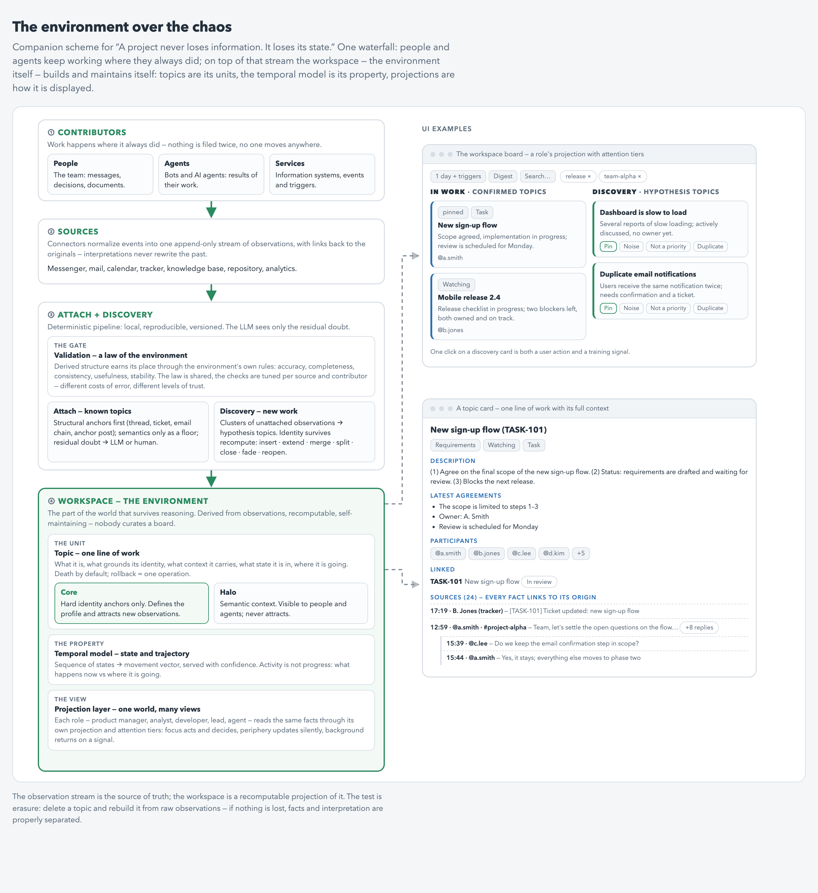

# A project never loses information. It loses its state.

*Second in the environment series: how a working environment builds itself on top of the tools a project already uses — and stays readable when the world is too large to read.*

> **Status: experimental architecture, currently being tested** on one production workspace. This is an essay, not a framework — a composition of existing approaches I am testing, written down as design laws. See [what is implemented and what is still hypothetical](#status-what-is-implemented-what-is-still-hypothetical).

**TL;DR**

- The recurring cost in any large project is not lost information but lost *state*: what's decided, what's moving, what's stuck. People and LLM agents alike rebuild it from history, every time.
- Instead of one more store the team must maintain, build the environment on top of the stream work already produces: chats, mail, meetings, tickets, docs, commits.
- Facts are append-only and permanent; every derived structure (topics, states, views) is a disposable projection. The test is erasure: delete a topic, rebuild it from raw facts, lose nothing.
- The unit is a topic with a **core** (hard identity anchors — it attracts new facts) and a **halo** (semantic context — it never attracts). That breaks the error-compounding loop.
- Deterministic pipeline first; the LLM only gets the residual ambiguity. One factual world, many role projections, three attention tiers.
- The human is the navigator, not the moderator; agent autonomy is earned tier by tier, on metrics, always reversible.

## The problem

Any large project produces a continuous stream of events: messages, emails, meetings, tasks, documents, decisions, commits. They are scattered across systems and never add up to a stable shared picture.

The information is rarely lost. What gets lost is the current state of the project.

To understand what is being worked on, what has been decided, which discussions are connected, where a risk appeared and what needs attention, a person reconstructs the project from its history — every time. A new team member does it. A manager does it before every status meeting. An agent does it the moment it gets access to the working tools.

The bigger the project, the more this reconstruction costs.

The classic answer is discipline: a single source of truth, groomed tickets, meeting minutes, a knowledge base, mandatory decision logs. That order exists only under constant manual effort, and it always lags the actual flow of work.

The alternative is not to move the project into one more store, but to build a working environment automatically, on top of the systems that already exist.

[The previous article](https://github.com/maaakso/environment-not-memory) defined the environment as the part of the world that survives reasoning, and left two laws open: how the environment's rules should be built, and how an agent reads a world far too large to read. This is that article — the construction manual for a project's environment.

## The four layers

**The observation stream.** The raw facts of the project: messages, emails, meetings, tasks, documents, decisions, commits, actions of people and agents. The stream is the source of truth, and it is append-only: interpretations never rewrite past facts, and a contradiction doesn't delete the old fact — it closes its validity window.

**Derived structure.** On top of the observations the environment grows topics, links, anchor artifacts, states and dependencies. None of this is truth — it is a recomputable projection of the working stream.

The architectural test is erasure, the same test that separates memory from environment: delete a topic, then rebuild it from raw observations. If nothing is lost, facts and interpretation are properly separated. If part of the project's knowledge disappears with the topic, the system has quietly become one more store that has to be maintained by hand.

**The temporal model.** The environment keeps not only the current snapshot but the sequence of states. That is what makes direction and speed computable: new centers of activity, fading directions, accumulating risk, shifting participants, attention moving between topics. The project is represented not only by a state but by a trajectory.

**Role projections.** The factual base is one, but its working view depends on who is looking. The role decides which topics are relevant, which facts enter the context, which links are shown, which risks are computed, how information is aggregated, which actions are available and what counts as a result.

So the environment is a shared factual model of the project with temporal and role projections.

And the law from the previous article applies here directly. Raw observations enter the environment freely, append-only — the environment lives its own life, independent of any agent. Derived structures — topics, states, vectors, projections — enter only through a validation gate: they are interpretations, and their right to exist is granted by the environment's rules, not by the will of whoever produced them, human or agent.

The gate's top-level rules are shared — accuracy, completeness, consistency, usefulness, stability. The concrete checks are not: review and approval for people, deterministic pipelines and shadow metrics for agents — and the gate is tuned per source and per contributor type, because a document from the owner, a conclusion from an agent and an automated event carry different costs of error and earn different levels of trust. The anatomy of these rules deserves an article of its own.

## The topic

The topic is the unit of the environment. It represents one line of work and answers five questions: what this work is; which facts ground its identity; what context is attached to it; what state it is in; where it is going.

A topic doesn't have to start with a tracker ticket. Work usually begins before the formal artifact: people discuss an idea, investigate a problem, test a constraint, negotiate a decision. At that stage the environment forms a hypothesis topic — a weak cluster of related signals.

If the signals stop, the topic fades. If a task, a document, a decision or another anchor artifact appears, it becomes the topic's core.

The lifecycle: weak signals → hypothesis topic → anchor artifact → stable core → accumulating context → state changes → completion or fading.

A tracker ticket doesn't create new work if that work already existed in the stream. It formalizes its identity. Which is how one topic ends up holding the discussion that preceded the ticket, the ticket itself, the decisions that followed, the documents, the emails, the commits and the related actions of agents.

## Identity anchors

Attaching a new observation to a topic must rest on structural evidence first. The strong anchors: a shared thread; a reference to the same ticket or document; an email chain identifier; a mention of a shared artifact; an explicit link between tasks; a common client or project identifier; a stable combination of participants, time and working context.

A separate class is anchor sources: dense, content-bearing posts — a meeting summary, a recorded decision, a public agreement. They don't link observations through a shared identifier; they found the topic, because they carry its informational base. On their own they are sufficient grounds for the core.

Semantic similarity is a supporting signal, never identity by itself. Two messages can mean nearly the same thing and belong to different products, clients, releases or decisions.

The attach pipeline runs in order: hard structural links → contextual checks → semantic filtering of candidates → a confidence score → the residual ambiguous cases handed to an LLM or a human.

The LLM must not make every decision about the structure of the environment. Otherwise the same stream can produce different results on reprocessing, and the model's mistakes feed into subsequent decisions. The center of the system stays local, reproducible and versioned. The LLM's role is the residual zone of uncertainty, naming, summarization and post-hoc quality control.

## Discovery

Attachment only works for topics that already exist. Finding new work is a separate process. Discovery picks out groups of observations not attached to any stable topic; checks whether they are a continuation of existing work; creates a hypothesis topic if the group is stable enough; and fixes its identity once an anchor artifact appears.

A recompute must not recreate a topic under a new identifier. The system distinguishes the operations: insert (a new topic appeared), extend (a topic gained new facts or a core), merge (several hypotheses turned out to be one line), split (one topic held several independent lines), close (finished), fade (moved to the background), reopen (a closed or faded topic got new signals).

Topic identity has to survive recomputation. Otherwise the map of the project is unstable and useless for history, links, metrics and anyone's attention.

## Core and halo

The main failure mode of an autonomous environment is positive feedback. A wrongly attached message shifts the topic's profile. The shifted profile attracts more similar messages. The new messages shift the profile further. A single mistake hardens into structure.

To break the loop, a topic is split into a core and a halo.

The **core** holds observations with strong identity grounds. It defines the topic's profile, participates in subsequent attach decisions, carries the stable identity, and is what the topic is rebuilt from.

The **halo** holds potentially related context: semantically similar messages, weak matches, supporting material, unconfirmed links. The halo is visible to humans and agents, but it never changes the topic's profile automatically.

Three rules follow. *The core attracts, the halo doesn't:* a weak attachment must never become the grounds for the next weak attachment. *Death by default:* a topic counts as alive only while new confirming signals arrive; absence of refutation proves nothing. *Reversibility:* a topic must be rebuildable from its core in one operation.

Judge an autonomous system not only by its precision, but by its ability to localize an error, explain a decision and roll it back.

## State and trajectory

The current status of a topic is not enough. Two topics can look equally active and be moving in opposite directions. So for every topic the environment computes not only a state but a movement vector: activity rising or falling; work accelerating or slowing; context widening or narrowing; participants joining or leaving; ownership shifting; approach to formalization, decision or completion; blockers accumulating; uncertainty growing; actual movement diverging from the plan; the discussion changing direction.

The movement vector is the most valuable signal in the environment and the least precise one. Activity is measured directly; direction is derived and open to interpretation, so it is served with a confidence level, never as a fact. High activity is not progress: a topic can generate a lot of messages while accumulating contradictions and getting no closer to a decision. That is why the activity metric is kept separate from the movement metric.

At the level of the whole environment, aggregate vectors are computed: which directions are gaining weight; which initiatives are losing attention; where new centers of work appear; where risk is concentrating; how resources are being redistributed; which topics systematically block others; which areas run ahead of plan and which fall behind.

A working environment answers two different questions: what is happening now, and where the project is going.

## Role projections

The same topic reads differently for different roles. Personalization changes neither the facts nor the topic's identity. It changes relevance, form, depth of detail, the set of computed risks, the available actions and the criteria of a result.

**A product manager** sees the user problem, the hypothesis, the decision taken, the impact on metrics, deadlines, dependencies, risks, expected actions.

**An analyst** sees the research question, data sources, metric definitions, data quality, assumptions, calculations, contradictions, verification requirements.

**A developer** sees technical constraints, architectural decisions, code changes, dependencies, blockers, tests, implementation status, related incidents.

**A lead** sees state, movement vector, owner, deadlines, cross-team dependencies, risk concentration, deviation from plan.

The same principle applies to agents. A research agent gets sources, claims, gaps, contradictions and the standard of evidence. An analyst agent gets data, definitions, quality constraints, formulas, assumptions and verification criteria. A coding agent gets specifications, technical context, the codebase, decisions taken, tests and the constraints of the execution environment.

Roles don't create independent versions of the project. They read one factual base through different working projections — which is how different people and agents work with a consistent world without everyone getting the same overloaded feed.

## Attention tiers

Role projections are completed by attention tiers — this is the answer to reading a world too large to read.

**Focus** — topics that demand actions or decisions from this specific role. Here the system uses strict thresholds, shows the grounds for its decisions and asks for confirmation when needed.

**Periphery** — active topics that don't need direct participation. They update automatically and rise into focus when a significant signal appears.

**Background** — inactive, weak, or irrelevant-to-this-role topics. They aren't deleted; they just don't occupy working attention. A topic returns from the background on a new signal, a role change or an explicit request.

A tier belongs not to the topic but to a role's relation to the topic. One topic can simultaneously be in a product manager's focus, on an analyst's periphery, in the background for a developer on another team, and in a research agent's working context. The environment is one — the maps of attention differ.

## The human is the navigator

If a person has to keep moving messages, merging topics and cleaning the structure, the system has reproduced an ordinary board with extra steps. The human's permanent function is not maintaining structure — it is distributing attention and resolving ambiguity.

The human can pull a topic closer or push it away, pin it, change its relevance for a role, confirm or reject a doubtful attachment, correct the reading of a movement vector. Each of these actions solves the user's problem and gives the system a training signal at the same time.

Full autonomy is not the goal: ambiguous cases will always exist, and it is the owner's preferences that make the map of the project *their* map. The navigator role is permanent by design, not something tolerated until automation catches up.

Autonomy cannot be switched on wholesale after installation. It is handed over in stages, and only on measured metrics — never on subjective trust. The order runs from the least risky tier to the most risky: first the system handles the background on its own, then the periphery, and last — the focus, and only under sustained quality. Until the metrics confirm a tier, that tier's decisions remain suggestions the human confirms or rejects. Every autonomous decision must be reversible: a wrong attachment is contained in the halo and rolled back out of the core in one operation.

Role projections earn autonomy independently. The system may already assemble technical context for a developer accurately while still misjudging product risks — then the first projection is autonomous and the second stays under confirmation.

The viability criterion: maintaining the environment should take minutes a day, not turn into a separate knowledge-management job.

## Metrics

The minimal set: precision of attachment to existing topics; share of missed links; discovery quality; identity stability across recomputes; number of manual corrections; share of decisions escalated to an LLM or a human; time between work appearing and being detected; accuracy of state; accuracy of direction; quality of role relevance; false-promotion rate into focus; cost of recovery from an error.

Measured separately: error compounding — how much one wrong attachment raises the probability of the next wrong decisions. This metric, not average precision, decides whether a tier is ready for autonomy.

The goal of the system is not to maximize autonomous operations but to minimize manual maintenance at a controlled cost of errors.

## The technical contour

**Sources:** messenger, mail, calendar, tracker, knowledge base, repository, analytics.

**Sync:** connectors normalize events into one observation schema and keep links to the original objects.

**Local store:** a relational base holds facts, links, topics and projection versions; a full-text index serves exact search; a vector index serves semantic candidates.

**Attach pipeline:** anchor rules, candidate extraction, ranking, confidence scoring and routing of ambiguous cases.

**Discovery:** background detection of weak clusters, novelty checks, topic lifecycle management.

**Temporal model:** state sequences, derived features, trends and movement vectors.

**Projection layer:** role views, attention tiers, risks and available actions.

**Quality control:** a decision journal, algorithm versions, metrics and human feedback.

**LLM layer:** ambiguous cases, naming and summarization, explanations, post-hoc audit.

Locality matters beyond privacy. Pinned data and algorithm versions make every computation repeatable, and the origin of every topic, link and projection explainable.

## Limits

The model doesn't work identically for every project. Strong signals depend on how a team actually works: in one project the main anchor is tickets, in another it is threads, documents, client identifiers or the structure of the repository. Role projections need configuration too: an analyst in a product company and an analyst in a research organization work with different context, risks and results.

So the system requires configuring sources, defining anchors, setting up roles, a debugging period on the real stream, accumulated feedback, and recalibration when processes change. It is not install-and-forget.

But its degradation is reversible: the raw observations stay intact, and topics, vectors and role projections can be recomputed.

## Status: what is implemented, what is still hypothetical

This architecture is being tested on one production workspace (a real team's stream: messenger, mail, calendar, tracker, knowledge base), not shipped as a product. Two earlier essays describe pieces that are already running: [the improvement loop around the pipeline](https://github.com/maaakso/warehouse-loop) (shadow metrics, eval-gated changes, roles designed to disappear) and [the environment-vs-memory paradigm itself](https://github.com/maaakso/environment-not-memory). An honest split as of July 2026:

**Implemented and running:**

- append-only ingestion of the observation stream from live sources, with bi-temporal facts: a contradiction closes the old fact's validity window instead of deleting it (~80k observations backfilled);
- the deterministic attach pipeline — identity anchors → contextual checks → semantic filtering → confidence score — running in shadow mode: every decision journaled, human-assessed against ground truth, only the residual ambiguity routed to an LLM;
- core/halo separation: the halo never mutates a topic's profile; core precision is measured on owner verdicts;
- the discovery loop: hourly birth of hypothesis topics, dedup against living topics only, immutable tombstones, a rebirth queue, and an LLM reviewer auditing births and retirements post-hoc;
- the improvement loop around all of it: shadow metrics, changes gated by a metric target declared before deployment, auto-revert on regression;
- reversibility in practice: append-only undo journals across every loop; corrections (demote from core, dedup override, rebirth) roll back in one operation;
- human gestures as training signals: pin, noise, duplicate, return-to-core — collected and used as ground truth.

**Partially implemented, under test:**

- role projections: two working view levels exist (the owner's full view vs a restricted scope for a shared agent), and the improvement loop runs on explicit agent roles; the general per-role projection layer with per-role risks is designed, not built;
- attention tiers: today's working analogs are pins (≈ focus), hypothesis/discovery status (≈ periphery) and noise/archive flags (≈ background); capture of attention events is built but not yet live;
- the temporal model: staleness and fade signals and trigger-born topics are computed in production; movement vectors as described are not;
- staged autonomy: the attach pipeline still runs as suggestions under confirmation — no tier has been handed over yet.

**Still hypothetical (designed, not built):**

- movement vectors and aggregate trajectories as first-class objects — the topic as a stored trajectory rather than a snapshot with history;
- attention tiers as a formal mechanism with per-tier budgets and per-tier autonomy metrics;
- the erasure test as a routine, automated check rather than an architectural principle.

## Prior art

The architecture is a composition of established approaches. **Event sourcing:** facts as an immutable stream, working structures as recomputable projections. **Bi-temporal facts:** a contradiction closes the old fact's validity window instead of deleting anything (Zep/Graphiti, [arXiv:2501.13956](https://arxiv.org/abs/2501.13956)). **Local-first:** the project keeps control of its data and computation. **Topic Detection and Tracking** and **First Story Detection:** topics discovered and tracked in a continuous stream, with discovery deciding whether a signal is a new story or a continuation; the merge/extend/insert operations ran in production at scale in Story Forest ([arXiv:1803.00189](https://arxiv.org/abs/1803.00189)). **DBSCAN:** the split into core points, border points and noise is the prototype of core-and-halo. **Temporal analytics:** state sequences turned into direction and speed. **Role-based views:** one factual model exposed through different representations, relevance and action sets. And the failure the whole design guards against is measured, not hypothetical: naive free-write memories degrade as they grow ([arXiv:2505.16067](https://arxiv.org/abs/2505.16067)) — the anti-compounding machinery exists because of numbers, not paranoia.

None of the parts are new. What is not established is the composition: all of them assembled into the environment of a project.

## The point

Don't give the team another place to move their work into. Build the environment over the stream the work already produces: facts in, append-only; interpretations in only through the gate; topics grown around hard identity; a core that attracts and a halo that doesn't; state plus trajectory; one factual world, many role projections; attention in tiers; autonomy earned tier by tier on metrics, with rollback always one operation away.

The environment doesn't remove the chaos, and it doesn't ask anyone to move. It builds, on top of the existing stream, a maintainable model of what is happening, where it is going, and which part of it matters to you.

## License

Text and diagrams: [CC BY 4.0](LICENSE). If code appears in this repository later, it will carry its own permissive license (MIT or Apache-2.0).
